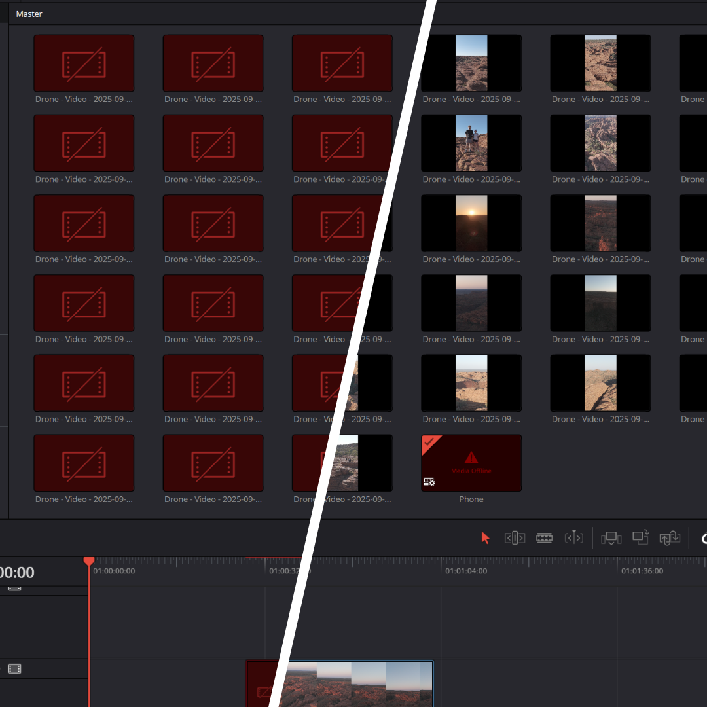
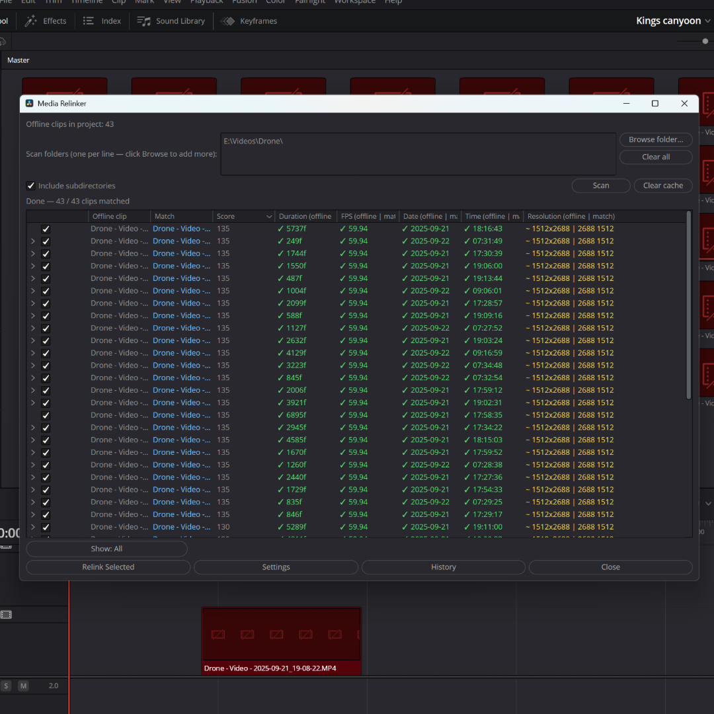

<div align="center">

# Media Relinker for DaVinci Resolve

**Get your missing clips back, fast.**

Works on free DaVinci Resolve and Studio. Runs entirely on your own machine.

[](https://www.blackmagicdesign.com/products/davinciresolve)
[]()
[](LICENCE)
[](#contributing)

</div>



---

## What is this?

If you've ever opened a DaVinci Resolve project and seen a wall of red "media offline" clips, this plugin is for you.

Maybe you moved your footage to a new drive. Maybe someone renamed the folders. Maybe you re-ingested a camera card and now Resolve can't find anything. Whatever happened, Media Relinker points at a folder, looks at each file on disk, and figures out which missing clip it belongs to — even when the filename has changed.

Click **Scan**, review the matches, click **Relink Selected**. Done.

---

## Why not just use "Relink Clips" in Resolve?

Resolve's built-in relink works when files have simply moved to a new folder but kept the same name. It matches by filename.

Media Relinker is for everything else — when filenames changed, folders were reorganised, or you've re-ingested camera cards so the originals and the replacements share nothing but the actual footage inside. It looks at the content of each file: timecode, duration, camera serial number, creation date, resolution, codec, and more. So even a completely renamed file can be matched back to the clip it came from.

---

## What you'll see



Every offline clip gets a row. Each row shows the best match found on disk, a confidence percentage, and a side-by-side comparison of duration, frame rate, date, time, and resolution — with green / yellow / red ticks so you can see at a glance which fields agree.

Tick the matches you're happy with and press **Relink Selected**.

---

## Install

1. Download or clone this repository.
2. From the project folder, run the installer:

   ```bash
   python install.py
   ```

   On Windows it will download ExifTool automatically. On macOS run `brew install exiftool` first. On Linux run `sudo apt install libimage-exiftool-perl`.

3. Restart DaVinci Resolve.

That's it. If you'd rather not use Python, there's a pure-Lua installer: `lua install.lua` (you'll need to install ExifTool yourself).

To uninstall, run `python install.py --uninstall`.

---

## How to use it

1. Open a Resolve project that has offline clips.
2. Go to **Workspace → Scripts → Comp → Media Relinker**.
3. Click **Browse folder…** and pick the folder where your footage lives. You can add more than one. Tick **Include subdirectories** if your footage is in nested folders.
4. Press **Scan**. This reads each file's metadata (it may take a few minutes the first time on a big library — subsequent scans are much faster).
5. Look at the results. Rows at high confidence are ticked automatically. Rows at medium confidence are shown but not ticked — you decide.
6. Press **Relink Selected**.

### The four buttons worth knowing

| Button | What it does |
|---|---|
| **Show** | Hide or show rows by confidence level (High, Medium, Low, No match). |
| **History** | See every relink you've ever done. Undo any of them. Or pick a different match from the alternatives captured at scan time. |
| **Settings** | Adjust how strict matching is, or how much each metadata field counts. |
| **Clear cache** | Forget all remembered metadata. The next scan will re-read every file. |

---

## Frequently asked questions

<details>
<summary><b>Does this work on the free version of DaVinci Resolve?</b></summary>

Yes. That was the main reason for building it. Most Resolve automation plugins need the paid Studio edition. This one runs entirely inside Resolve itself, so the free edition works fine.

</details>

<details>
<summary><b>Will it change my original files?</b></summary>

No. Media Relinker only updates where Resolve points to look for a clip. Your footage on disk is never moved, renamed, or modified. And every relink is logged, so you can undo it from the History window at any time.

</details>

<details>
<summary><b>How does it actually match clips?</b></summary>

It looks at the metadata embedded inside each file — things like timecode, duration, camera serial number, creation date, frame rate, resolution, and codec. The more of these that agree between your offline clip and a file on disk, the higher the confidence score. A perfect match on timecode and duration alone is usually enough.

</details>

<details>
<summary><b>What file formats work?</b></summary>

Anything ExifTool can read: BRAW, R3D, ARRIRAW, ProRes, DNxHR, H.264, HEVC, MP4, MOV, MXF, plus common image and audio formats (WAV, AIFF, JPG, TIFF, DPX, EXR, etc.). Files with accurate embedded timecode relink most reliably.

</details>

<details>
<summary><b>Can I relink proxies back to camera originals?</b></summary>

Yes, as long as they share timecode and duration. If your proxies don't carry much metadata, open **Settings** and lower the auto-match threshold.

</details>

<details>
<summary><b>What if it matches the wrong file?</b></summary>

You can untick it before relinking. If you've already relinked, open **History** and either revert it, or pick one of the alternative candidates that were captured at scan time.

</details>

<details>
<summary><b>The script doesn't show up in Resolve's Scripts menu.</b></summary>

Re-run the installer and restart Resolve. If that doesn't work, check that the script was copied to Resolve's `Fusion/Scripts/Comp/` folder.

</details>

<details>
<summary><b>It says "No offline clips found" but I can see red clips in my Media Pool.</b></summary>

Media Relinker looks at video, audio and still clips. It skips Timelines, Compound Clips and Fusion Comps on purpose. If you only have those, there's nothing to relink.

</details>

---

## Contributing

Pull requests are welcome. The plugin is a few thousand lines of Lua split across about a dozen files — have a look around and open an issue if anything is unclear.

Tests live under `tests/`. Run them with `lua tests/run_all.lua`.

---

## License

MIT. See [LICENCE](LICENCE). The bundled JSON parser (`vendor/json.lua`) is by [rxi](https://github.com/rxi/json.lua), also MIT.
